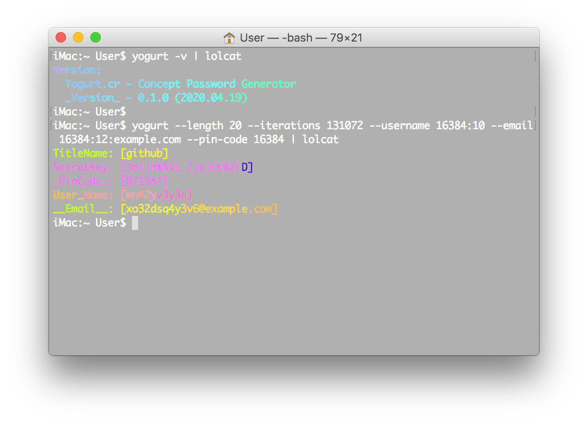

<div align = "center"></div>

<div align = "center">
  <h1>Yogurt.cr - Concept Password Generator</h1>
</div>

<p align="center">
  <a href="https://crystal-lang.org">
    </a>
  <a href="https://travis-ci.org/636f7374/yogurt.cr">
    </a>
  <a href="https://github.com/636f7374/yogurt.cr/releases">
    </a>
  <a href="https://github.com/636f7374/yogurt.cr/blob/master/license">
  	</a>
</p>

<div align = "center"><a href="#"></a></div>

## Description

* It uses `Sha384`, `Adler32`, `Blake2B512`, `HMAC`, `Pbkdf2 HMAC` algorithms and Character Offset.
* The internal structure is very simple, only 300 lines of code.
* It can be used either under CommandLine or as Crystal Shard.
* Generate (SecretKey, UserName, EmailAddress, PinCode) through MasterKey and SecureId.

### RoadMap

* [ ] Add Spec Unit & Travis-CI Test.
* [ ] ...

## Use Shield

### Used as Shard

Add this to your application's shard.yml:

```yaml
dependencies:
  yogurt:
    github: 636f7374/yogurt.cr
```

### Usage

* Yogart - Example

```crystal
require "yogart"

secure_id = Yogart.create_secure_id value: "github"
secret_key = Yogart.create_secret_key master_key: "abc123", secure_id: secure_id, length: 20_i32, iterations: 131072_i32
user_name = Yogart.create_user_name secret_key: secret_key, secure_id: secure_id, length: 15_i32, iterations: 16384_i32
email = Yogart.create_email domain: "example.com", user_name: user_name, secure_id: secure_id, iterations: 15_i32, length: 20_i32
pin_code = Yogart.create_pin secret_key: secret_key, secure_id: secure_id, iterations: 16384_i32
```

### Installation

```bash
$ git clone https://github.com/636f7374/yogurt.cr.git
$ cd yogurt.cr && make build && make install
```

## Development

```bash
$ make test
```

## Credit

* [\_Icon - Freepik/Energy](https://www.flaticon.com/packs/sustainable-energy-46)
* [Shard - crystal-lang/crystal-readline](https://github.com/crystal-lang/crystal-readline)

## Contributors

|Name|Creator|Maintainer|Contributor|
|:---:|:---:|:---:|:---:|
|**[636f7374](https://github.com/636f7374)**|√|√||

## License

* MIT License
